<!--
═══════════════════════════════════════════════════════════════════════════
  README — João Pedro · github.com/11joao44
  ───────────────────────────────────────────────────────────────────────
  CHECKLIST DE SETUP (faça uma vez):
   1. Crie a pasta "assets/" DENTRO do repo de perfil (11joao44/11joao44)
      e suba assets/header.svg ali (não no repo "assets" separado).
   2. Confira o link do LinkedIn abaixo — o atual tem caractere acentuado.
   3. Projetos: quando publicar um repo, é só linkar o título do card.
   4. (Opcional) Ative a cobrinha: crie .github/workflows/snake.yml
      (conteúdo enviado junto na conversa).
   5. Os cards de stats usam sua própria instância (…navy-eta) p/ evitar
      rate limit. Mantenha assim ou troque pela pública se preferir.
═══════════════════════════════════════════════════════════════════════════
-->

<!-- ░░ HERO ░░ banner animado custom. Se preferir zero-setup, troque a linha
     abaixo por:  -->


<div align="center">


&nbsp;

<a href="https://linkedin.com/in/jo%C3%A3o-dev"></a>
<a href="mailto:11joao44@gmail.com"></a>
<a href="https://wa.me/5565981126587"></a>


</div>

<br/>

## 🧩 Sobre

Desenvolvedor **full stack** e **especialista em automação**. Transformo processos manuais e planilhas caóticas em sistemas digitais rápidos, observáveis e escaláveis — unindo análise de processos com engenharia de software moderna (**Clean Architecture**, **Event-Driven**, cultura **DevOps**).

```rust
fn main() {
    let joao = Engineer {
        name:     "João Pedro",
        role:     "Full Stack & Automation Engineer",
        company:  "RedeFlex",
        location: "Cuiabá, Mato Grosso, BR",
        stack:    Stack::new(["Rust", "Python", "TypeScript"]),
        focus:    [
            "RPA & Computer Vision",
            "Sistemas em tempo real",
            "Performance & Clean Architecture",
        ],
    };

    joao.build(); // 🚀 sempre em construção
}
```

<br/>

## ⚡ Stack

<div align="center">

    

   

   

     

    

     

</div>

<br/>

## 🚀 Projetos em Destaque

<!-- 💡 Quando publicar um repo, envolva o título em link, ex.:
     <a href="https://github.com/11joao44/SEU-REPO"><h3>🦀 Coach LoL</h3></a> -->
<table>
<tr>
<td valign="top" width="50%">

<h3>🦀 Coach LoL — YOLO Rust Agent</h3>
<i>Visão computacional em tempo real</i><br/><br/>
Detecção de ícones no minimapa a <b>60+ FPS</b>, com <b>filtros de Kalman</b> para rastrear trajetórias e prever movimentos dos adversários.<br/><br/>
    

</td>
<td valign="top" width="50%">

<h3>🧠 Synth Flashcards</h3>
<i>Estudo inteligente com resumos via IA</i><br/><br/>
Plataforma de produtividade acadêmica com autenticação <b>JWT</b> segura e editor Markdown otimizado.<br/><br/>
   

</td>
</tr>
<tr>
<td valign="top" colspan="2">

<h3>📡 WhatsApp ⇄ Discord Gateway</h3>
<i>Infra bidirecional assíncrona para alta demanda de mensagens</i><br/><br/>
Processamento de <b>50k+ mensagens/dia</b> com <b>−80%</b> no tempo de resposta, através de uma arquitetura totalmente assíncrona.<br/><br/>
   

</td>
</tr>
</table>

<br/>

## 📊 Métricas

<div align="center">


<br/>


<!-- 🐍 cobrinha — requer o workflow .github/workflows/snake.yml -->
<picture>
  <source media="(prefers-color-scheme: dark)" srcset="https://raw.githubusercontent.com/11joao44/11joao44/output/github-snake-dark.svg" />
  
</picture>

</div>

<br/>

## 🤝 Vamos construir algo

<div align="center">

Aberto a freelas, colaborações e ideias que envolvam **automação, performance e sistemas inteligentes**.

<a href="mailto:11joao44@gmail.com"></a>


</div>
